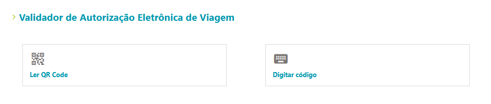
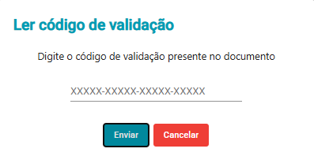
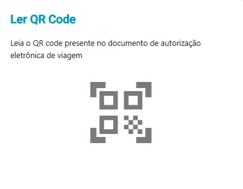

# TravelPermitWeb

Este web app desenvolvido pela Lacuna atende as demandas dos agentes que precisam verificar as informações de documentos de Autorização Eletrônica de Viagem.

## Preparando o ambiente

#### Dependências
O TravelPermiteWeb utiliza o Angular v11.  
Para baixa-lo, é necessário instalar o Node. Para isso, recomenda-se utilizar alguma ferramenta para gerenciamento das versões como o Nvm-Windows e seguir os seguintes passos:

- Baixe e instale o `NVM for Windows` em em: [Releases · coreybutler/nvm-windows ](https://github.com/coreybutler/nvm-windows/releases)  

- Agora, no terminal, instale a versão `12.11.1` do Node: `nvm install 12.11.1`

- Ative o Node instalado no seu terminal: `nvm use 12.11.1`

### Projeto

- Clone o repositório na sua máquina: `git clone git@bitbucket.org:Lacunas/travel-permit.git `

- Vá para a pasta do projeto : `cd travel-permit`

- Instale as dependências: `npm install`

- Inicie o projeto do front-end: `npm run start`. O projeto estará disponível em http://localhost:4200/

### Utilização do Sistema

Para verificar as informações de um documento de AEV(Autorização eletrônica de viagem) é preciso informar um código de validação ou ler um QR Code.

No caso de validações feitas a partir de um código de validação, é feita uma chamada ao back-end para carregar os dados do documento.

Já no caso de validações a partir do QR Code, é feita uma chamada ao servidor para carregar informações adicionais, porém é possível validar os dados contidos no QR Code de forma offline

Para testar QRCodes sem scan via browser, é necessário ler com dispositivo mobile e passar a string como parâmetro ao método parseQrCodeData(string)

### Versionamento

Neste projeto a branch develop não é utilizada para deploys para homologação. Deve se criar as branches de desenvolvimento a partidr da `master` e direcionar pull-requests também a ela

### Deploy

O deploy desta aplicação é feito via ftp para os servidores na Azure.

- O processo se inicia executando o comando `npm run build:hml`.

- Os arquivos estarão disponíveis em `dist/travelpermit-web`

- É necessário agora que um colaborador com as autorizações necessárias transfira os arquivos gerados ao serviço da Azure
